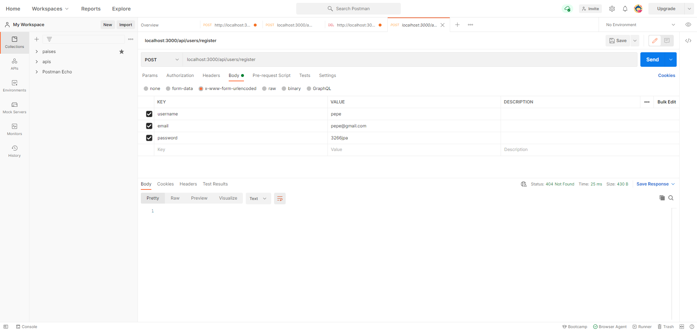
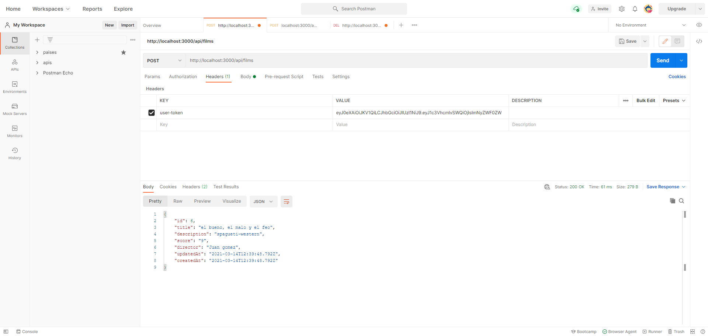
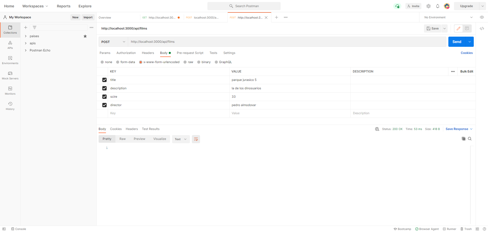
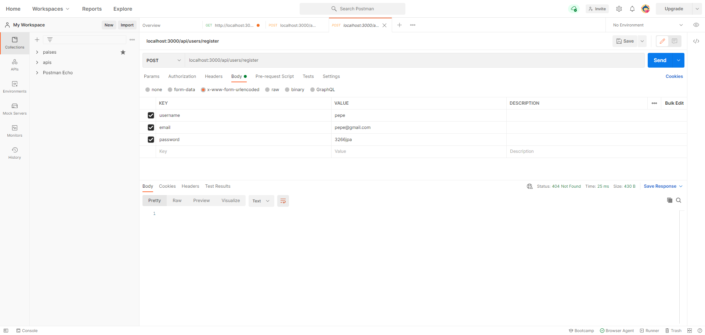
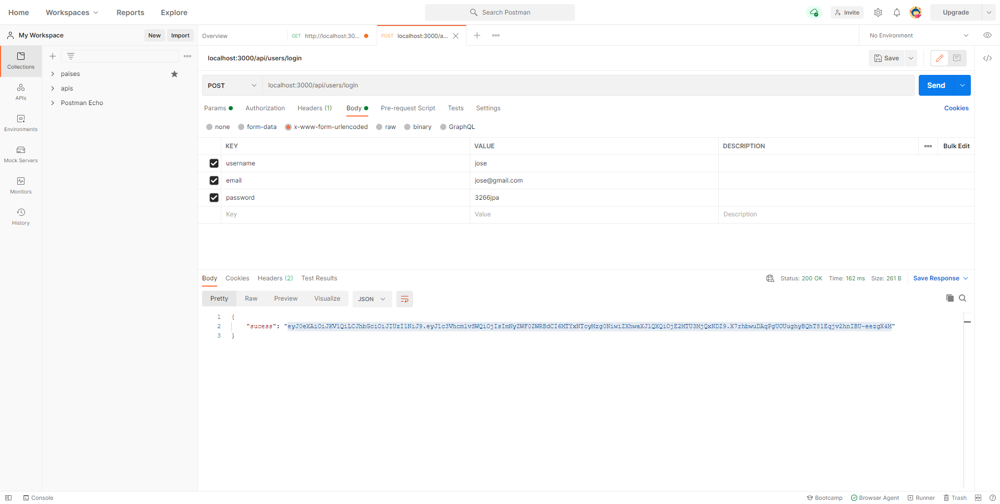

# api-crud-nodejs--v15--auth--sequelize
API CRUD CON NODEJS V15  , AUTHENTICATION Y SEQUELIZE
### Antes de comenzar debemos crear la base de datos apirest en mysql. Las tablas se crean automaticamente

